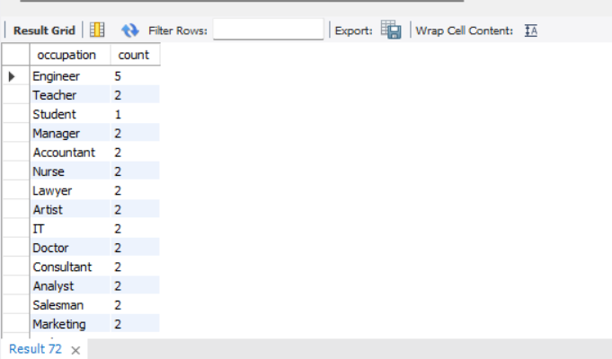

# 🏦 Bank Analytics: Loan & Credit Card Transactions Insights  

  

## 📌 Project Overview  
This project leverages two financial datasets — **Loan Applications** and **Credit Card Transactions** — to derive meaningful insights for banks and financial institutions. Using **MySQL**, we analyze loan approvals, customer demographics, income trends, credit scores, and fraud detection in credit card transactions.  

The project aims to provide **data-driven strategies** to improve loan approval policies, detect fraudulent activities, and understand customer spending patterns.  

---

## 🎯 Project Goals  

### 💳 Loan Analytics  
- 📌 Understand loan approval trends across demographics (age, gender, marital status, education, occupation).  
- 📊 Analyze income and credit score distribution for approved vs rejected loans.  
- 📈 Identify high-value applicants and factors driving approvals.  

### 🏧 Credit Card Transactions Analytics  
- 🔍 Detect fraudulent vs non-fraudulent transactions.  
- 🏬 Identify top merchants and transaction categories.  
- 📊 Customer-level insights: top spenders, transaction frequency, and volume.  
- 📅 Analyze transaction trends across months.  

---

## 🛠️ Tools & Technologies Used  
- **SQL (MySQL Workbench)** – Data extraction, transformation, querying  
- **Loan Dataset** – [Kaggle: Bank Loan Applications](https://www.kaggle.com/datasets/vipin20/loan-application-data)  
- **Credit Card Transactions Dataset** – [Kaggle: Credit Card Transactions](https://www.kaggle.com/datasets/rajatsurana979/comprehensive-credit-card-transactions-dataset)  

---

## 📊 Insights & Expected Outcomes  
- 📢 *Improved credit risk management* by analyzing applicant demographics.  
- 💵 *Fraud detection system* for financial transactions.  
- 🛍️ *Merchant performance analysis* for partnership opportunities.  
- 📈 *Customer behavior insights* for targeted financial products.  

---

# 🔍 SQL Queries & Visualizations  

This repository contains SQL queries along with insights and visualizations.  

---

### 1. Total Loan Applications  
**Query:** Count total number of loans in the dataset.  
  

### 2. Loan Approval vs Rejection  
**Query:** Compare approved and rejected loans.  
  

### 3. Average Applicant Income  
**Query:** Find average applicant income across dataset.  
  

### 4. Average Credit Score  
**Query:** Calculate average credit score of applicants.  
  

### 5. Loans by Gender  
**Query:** Analyze loan distribution by gender.  
  

### 6. Loans by Occupation  
**Query:** Breakdown of loans across different occupations.  
  

### 7. Loans by Education Level  
**Query:** Distribution of loans by education qualification.  
  

### 8. Loan Approval Rate by Gender  
**Query:** Approved vs rejected loans based on gender.  
  

### 9. Loan Approval Rate by Occupation  
**Query:** Approval rates across different job categories.  
  

### 10. Loan Approval Rate by Education Level  
**Query:** Loan approvals vs rejections by education.  
  

### 11. Loan Approval Rate by Marital Status  
**Query:** Approved vs rejected loans for married vs single applicants.  
  

### 12. Top 5 High Income Approved Applicants  
**Query:** Find top 5 highest income applicants with approved loans.  
  

### 13. Total Credit Card Transactions  
**Query:** Count total number of credit card transactions.  
  

### 14. Fraudulent vs Non-Fraudulent Transactions  
**Query:** Fraud detection analysis.  
  

### 15. Fraud vs Non-Fraud Transaction Amounts  
**Query:** Total transaction amounts comparison.  
  

### 16. Top 5 Merchants with Most Transactions  
**Query:** Find merchants with the highest number of transactions.  
  

### 17. Average Transaction Amount (Fraud vs Non-Fraud)  
**Query:** Compare fraud and non-fraud average transaction size.  
  

### 18. Transaction Distribution by Category  
**Query:** Count transactions by category.  
.png)  

### 19. Customers with Highest Number of Transactions  
**Query:** Top customers by transaction frequency.  
.png)  

### 20. Monthly Transaction Trends  
**Query:** Analyze transaction activity month-wise.  
.png)  

### 21. Average Transaction Amount by Month           
**Query:** Find monthly average transaction amount.  
  

### 22. Total Transaction Amount per Customer  
**Query:** Calculate spending per customer.  
  

### 23. Top 10 merchants by transaction volume  
**Query:** Merchants with maximum transactions.  
  

### 24. Top 10 merchants with the highest total transaction amount  
**Query:** Merchants generating maximum revenue.  
  

### 25. Top 5 Customers by Transaction Amount  
**Query:** High-spending customers.  
  

---

## 📌 Conclusion  
This project successfully demonstrates how **SQL-based analysis** can help financial institutions:  
- Improve **loan approval processes** with demographic insights.  
- Strengthen **fraud detection systems** using transaction data.  
- Enhance **customer engagement** by understanding spending patterns.  
- Support **strategic decisions** for business growth.  
